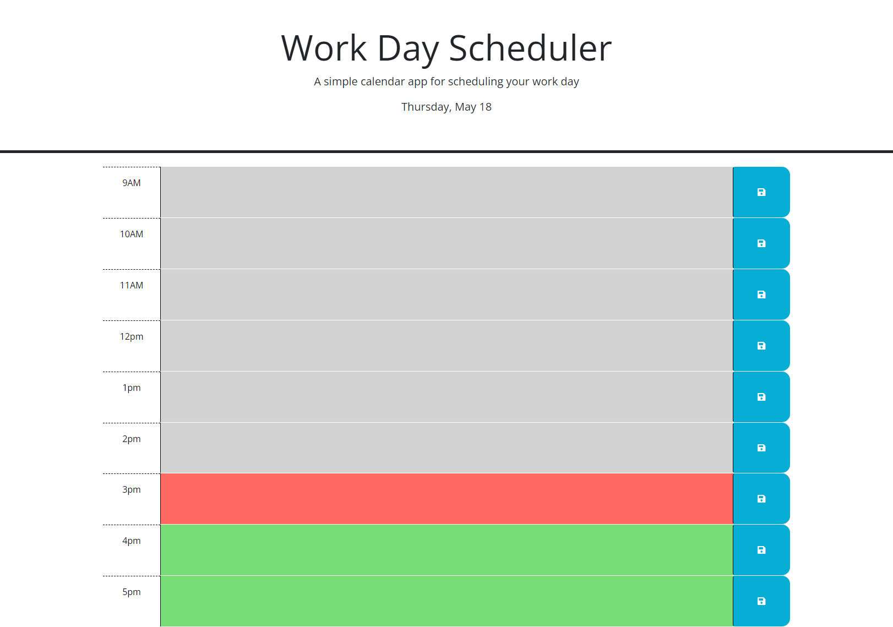

# Daily Planner
## description 
This is a daily planner for planning your work day hour by hour. The time ranges from 9am to 5pm and is color coded past(gray), present(red), and future(green). Once the task is entered it saved with the local storage. 

link to calandar is https://tankb220.github.io/work-day-scheduler/

